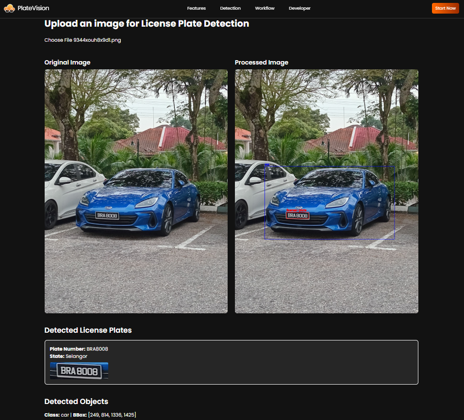

# 🚗 License Plate Recognition & State Identification System
The License Plate Recognition & State Identification System is a web-based application built with FastAPI (backend) and ReactJS (frontend) that automatically detects vehicles, extracts license plates, recognizes the plate text, and identifies the vehicle’s state based on the first character of the license plate.  
The system uses a YOLO-based object detection model to detect both vehicles and license plates from images or video frames. Once the plate region is detected, PaddleOCR is applied to perform optical character recognition (OCR) and extract the license plate number. Using the first letter of the recognized plate, the system then maps it to the corresponding state code (e.g., J → Johor, P → Penang, etc.).  

Designed as an end-to-end intelligent traffic and monitoring tool, this system can be integrated into:  
- 🚓 Traffic monitoring & enforcement
- 🅿️ Smart parking systems
- 🛂 Access control & security checkpoints

It provides a simple, browser-based interface where users can upload images (or connect to future live video feeds), view detected vehicles and plates, see the recognized plate number, and automatically retrieve the identified state in real time.

---

## 🧰 Prerequisites

Before getting started, ensure the following tools are installed on your system:

### Core Software

 [**Node.js**](https://nodejs.org/en) – Required for FastAPI backend, YOLO model, and PaddleOCR.  
 [**Python**](https://www.python.org/downloads/) – Required for ReactJS frontend.

### AI / ML Tools  
<a href="https://colab.research.google.com" target="_blank" rel="noreferrer">  <strong>Google Colab</strong> </a> – For YOLO model training and experimentation.  

<a href="https://universe.roboflow.com" target="_blank" rel="noreferrer">  <strong>Roboflow</strong> </a> – Dataset annotation, preprocessing, labeling.  

<a href="https://www.ultralytics.com/hub" target="_blank" rel="noreferrer">  <strong>Ultralytics Hub</strong> </a> – For managing YOLO training and version tracking.  

---

## 📥 Installation You can get the project files in two ways: 
### 📌 Option 1: Clone via Git
``` bash
# Clone the repository using Git
git clone https://github.com/zseng0912/ANPR-System.git

# Navigate into the project folder
cd your-repo-name
```

### 📌 Option 2: Download ZIP 
1. 🔗 Visit the repository on [GitHub](https://github.com/zseng0912/nutri-recommendation.git)
2. ⬇️ Click on the green **"Code"** button
3. Select **"Download ZIP"**
4. 🗂️ Extract the ZIP file to your desired location
5. 📂 Open the extracted folder in your preferred code editor

--- 

## 🚀 Getting Started 

### 1. Run FastAPI Backend
``` bash
# Create a virtual environment
python -m venv <virtual_environment_name>

# Activate virtual environment (Windows)
<virtual_environment_name>\Scripts\activate

# Install dependencies
pip install -r requirements.txt

# Start FastAPI server
uvicorn main:app --host 0.0.0.0 --port 8000
```

### 3. Run Frontend (LPR System)
``` bash
cd frontend

# Install Node Modules
npm install

# Start the app
npm run dev
```

---

## 📸 Sample Output


---

## 📊 Model Details

### YOLOv8
- Vehicle detection & License plate detection (custom trained)
- Format: .pt weights
- Loaded inside FastAPI on startup

### PaddleOCR
- Language: English
- Uses CRNN recognition model
- Handles noisy and low-resolution plates

### State Identification
Based on Malaysian plate prefix:
``` bash
A	→ Perak
B	→ Selangor
C	→ Pahang
D	→ Kelantan
J	→ Johor
K	→ Kedah
M	→ Melaka
N	→ Negeri Sembilan
P	→ Pulau Pinang
R	→ Perlis
S	→ Sabah
T	→ Terengganu
W	→ Kuala Lumpur
V	→ Labuan
Q	→ Sarawak
```
---

## 🛤️ Future Improvements

1. Live video stream detection (OpenCV + WebRTC)
2. Multi-vehicle tracking using DeepSORT
3. Automatic fine/payment integration
4. Database history logging
5. Websocket real-time updates

---

## 🧾 Acknowledgements
 
I would like to thank my lecturer, for the guidance and support throughout this project.  
Special thanks to my teammate for the cooperation and contributions.

---
